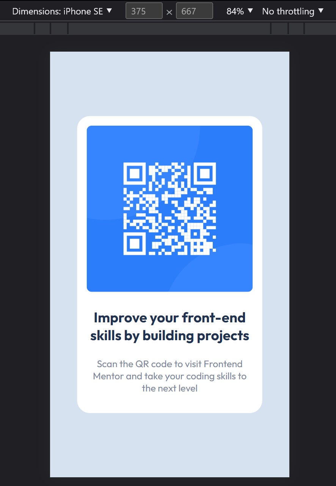
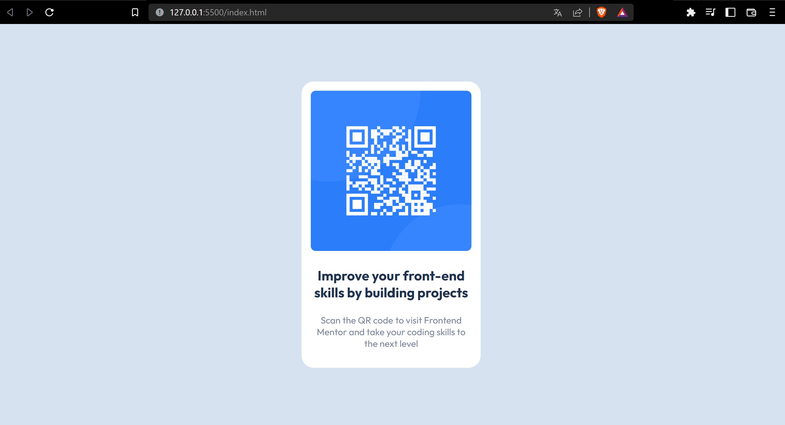

# Frontend Mentor - QR code component solution

This is a solution to the [QR code component challenge on Frontend Mentor](https://www.frontendmentor.io/challenges/qr-code-component-iux_sIO_H). Frontend Mentor challenges help you improve your coding skills by building realistic projects. 

## Table of contents

- [Frontend Mentor - QR code component solution](#frontend-mentor---qr-code-component-solution)
  - [Table of contents](#table-of-contents)
  - [Overview](#overview)
    - [📸 Screenshots](#-screenshots)
    - [🔗 Links](#-links)
  - [My process](#my-process)
    - [Built with](#built-with)
    - [What I learned](#what-i-learned)
    - [Continued development](#continued-development)
    - [Useful resources](#useful-resources)
  - [Author](#author)
  - [Acknowledgments](#acknowledgments)

**Note: Delete this note and update the table of contents based on what sections you keep.**

## Overview

### 📸 Screenshots




### 🔗 Links

- 📦 Solution URL: [Github Repo](https://github.com/jtlaxcalaDev/Frontend-Mentor-QR-component-vanilla)
- 🚀 Live Site URL: [Vercel Deploy](frontend-mentor-qr-component-vanilla.vercel.app)

## My process

### Built with

- ✅ Semantic HTML5 markup
- ✅ CSS custom properties and variables
- ✅ Flexbox
- ✅ Mobile-first workflow

### What I learned

- ✨CSS variables:

```css
:root {
  --white: hsl(0, 0%, 100%);
  --light-ray: hsl(212, 45%, 89%);
  --grayish-blue: hsl(220, 15%, 55%);
  --dark-blue: hsl(218, 44%, 22%);
}

.qr-card .card-description {
  color: var(--grayish-blue);
  font-weight: 400;
}

```

### Continued development

### Useful resources

- 🚀 [Vercel](https://vercel.com/docs/concepts/git#deploying-a-git-repository) - This documentation help me to deployed the project fast and easy

## Author

- 👨‍🚀 Frontend Mentor - [@jtlaxcalaDev](https://www.frontendmentor.io/profile/jtlaxcalaDev)

## Acknowledgments

Thank you for your time to review my code project for QR component challenge in Frontend Mentor.
